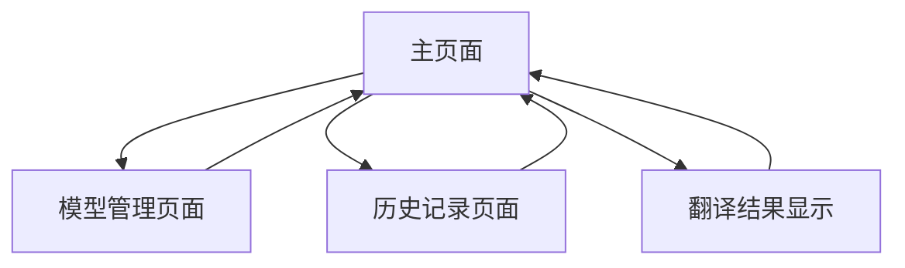

# Transformer 中英翻译 Demo 产品需求文档

## 1. 产品概述
基于 Transformer 架构的中英文双向翻译演示应用，提供实时文本翻译功能和直观的用户交互界面。
- 解决用户快速准确翻译中英文文本的需求，适用于学习、工作和日常交流场景。
- 展示 Transformer 模型在自然语言处理领域的实际应用价值。

## 2. 核心功能

### 2.1 用户角色
无需区分用户角色，所有用户均可直接使用全部翻译功能。

### 2.2 功能模块
我们的翻译 demo 包含以下主要页面：
1. **主页面**：翻译输入区域、结果显示区域、语言切换控制
2. **模型管理页面**：模型加载状态、性能监控、配置调整
3. **历史记录页面**：翻译历史查看、收藏管理、导出功能

### 2.3 页面详情

| 页面名称 | 模块名称 | 功能描述 |
|----------|----------|----------|
| 主页面 | 翻译输入区域 | 支持中英文文本输入，实时字符计数，清空按钮 |
| 主页面 | 结果显示区域 | 显示翻译结果，支持复制到剪贴板，翻译质量评分 |
| 主页面 | 语言切换控制 | 中译英/英译中切换，自动检测语言选项 |
| 主页面 | 翻译操作 | 执行翻译、重新翻译、翻译进度显示 |
| 模型管理页面 | 模型状态监控 | 显示模型加载状态、内存使用情况、推理速度 |
| 模型管理页面 | 配置调整 | 调整翻译参数（温度、最大长度等），模型切换 |
| 历史记录页面 | 翻译历史 | 查看历史翻译记录，按时间排序，搜索功能 |
| 历史记录页面 | 收藏管理 | 收藏重要翻译，添加标签，批量操作 |
| 历史记录页面 | 数据导出 | 导出翻译历史为 JSON/CSV 格式 |

## 3. 核心流程

**主要用户操作流程：**
用户进入主页面 → 选择翻译方向（中译英/英译中）→ 输入待翻译文本 → 点击翻译按钮 → 查看翻译结果 → 可选择复制结果或保存到历史记录。

**模型管理流程：**
用户访问模型管理页面 → 查看当前模型状态 → 调整翻译参数 → 应用配置更改 → 返回主页面进行翻译测试。

**历史记录流程：**
用户访问历史记录页面 → 浏览历史翻译 → 搜索特定记录 → 收藏重要翻译 → 导出数据。

## 4. 用户界面设计

### 4.1 设计风格
- **主色调**：深蓝色 (#2563eb) 和浅灰色 (#f8fafc)
- **辅助色**：绿色 (#10b981) 用于成功状态，橙色 (#f59e0b) 用于警告
- **按钮样式**：圆角矩形，悬停时有阴影效果
- **字体**：主要使用 Inter 字体，中文使用思源黑体，字号 14-16px
- **布局风格**：卡片式布局，顶部导航栏，响应式设计
- **图标风格**：使用 Heroicons 线性图标，简洁现代

### 4.2 页面设计概览

| 页面名称 | 模块名称 | UI 元素 |
|----------|----------|----------|
| 主页面 | 翻译输入区域 | 大型文本框，占屏幕宽度 80%，高度 120px，圆角边框，聚焦时蓝色边框 |
| 主页面 | 结果显示区域 | 只读文本框，与输入框相同样式，背景色 #f1f5f9 |
| 主页面 | 语言切换控制 | 双向箭头按钮，中英文标签，点击切换动画效果 |
| 主页面 | 翻译操作 | 主要按钮使用蓝色背景，白色文字，加载时显示旋转图标 |
| 模型管理页面 | 模型状态监控 | 状态卡片布局，使用进度条和数值显示，绿色表示正常 |
| 模型管理页面 | 配置调整 | 滑块控件和下拉选择框，实时预览参数变化 |
| 历史记录页面 | 翻译历史 | 列表视图，每项包含时间戳、原文预览、译文预览 |
| 历史记录页面 | 收藏管理 | 星形图标标记收藏，标签使用彩色徽章样式 |
| 历史记录页面 | 数据导出 | 下载按钮，支持格式选择的下拉菜单 |

### 4.3 响应式设计
桌面优先设计，支持移动端自适应。在移动设备上优化触摸交互，按钮尺寸不小于 44px，文本框支持触摸滚动。